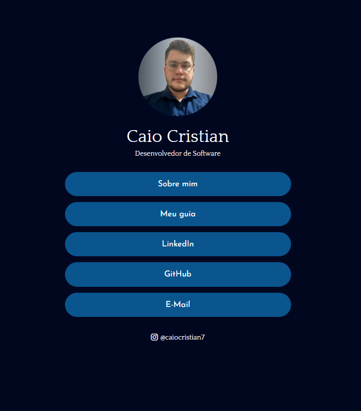

# Insta Caio Link

Este é um projeto de página pessoal para Caio Cristian, desenvolvedor de software. A página contém links para várias seções, incluindo "Sobre Mim", "Meu Guia" e links para perfis de redes sociais.

## Estrutura do Projeto

O projeto é composto pelos seguintes arquivos e diretórios:

insta-caio-link/ ├── index.html ├── style.css ├── Sobre-mim/ │ └── sobre-mim.html ├── Meu-guia/ │ ├── meu-guia.html │ └── meu-guia.css └── images/ └── Foto-perfil.png


### index.html

A página principal do projeto. Contém links para as seções "Sobre Mim" e "Meu Guia", além de links para perfis de redes sociais.

### style.css

Arquivo de estilo principal para a página `index.html`.

### sobre-mim.html

Página "Sobre Mim" que contém informações sobre Caio Cristian, sua carreira e interesses.

### meu-guia.html

Página "Meu Guia" que contém um guia de programação com várias seções, incluindo introdução à programação, lógica de programação, principais linguagens de programação, desenvolvimento web, ferramentas e ambientes de desenvolvimento, práticas e conceitos avançados, e dicas para evoluir na programação.

### meu-guia.css

Arquivo de estilo específico para a página `meu-guia.html`.

### images/

Diretório que contém a imagem de perfil utilizada no projeto.

## Tecnologias Utilizadas

- HTML
- CSS
- Bootstrap
- Bootstrap Icons
- Google Fonts

## Como Executar o Projeto

1. Clone o repositório para o seu ambiente local:
    ```bash
    git clone https://github.com/seu-usuario/insta-caio-link.git
    ```

2. Navegue até o diretório do projeto:
    ```bash
    cd insta-caio-link
    ```

3. Abra o arquivo [index.html](http://_vscodecontentref_/2) no seu navegador preferido ou utilize uma extensão de servidor local, como o Live Server no Visual Studio Code.

## Contato

Para mais informações, entre em contato com Caio Cristian através do e-mail [caiocristianoliveiramarques@gmail.com](mailto:caiocristianoliveiramarques@gmail.com) ou siga-o no Instagram [@caiocristian7](https://www.instagram.com/caiocristian7/).

---

Este projeto foi desenvolvido como uma página pessoal para Caio Cristian, com o objetivo de compartilhar informações e links úteis sobre sua carreira e interesses em desenvolvimento de software.

## Imagem do Projeto

